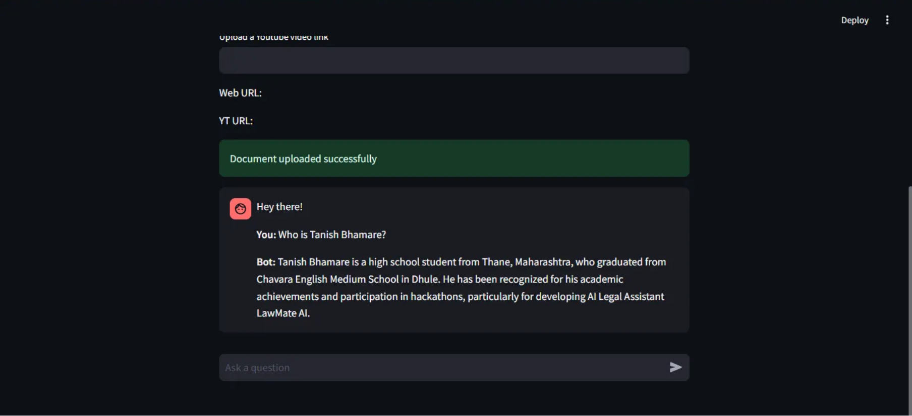
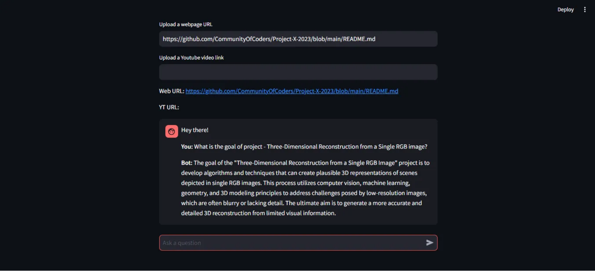
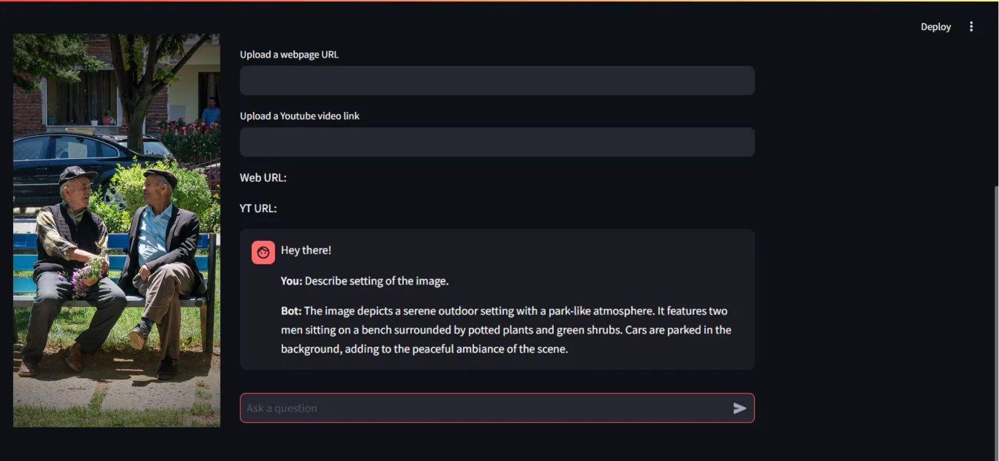

# Not-So-Generic-Chatbot
### This is the project under Project X - 2024
## Description
Traditional LLMs have a limited Scope and their outputs just depend on the data it is originally trained on. If a user asks a query, the response of which depends on a specific chunk of information which might not be related to the general data llms are trained on then the output obtained is not reliable and may lead to false decisions. RAG is a great way to overcome this issue, also it is comparitively efficient than other techniques like fine-tuning. Due to the dawn of Multimodal LLMs, the limited scope of RAGs to utilise only text documents is expanding to include other media like images. In this project we aim to develop a topic specific chatbot that will havev additional context, using MultiModal RAG.It will be able to take text and image inputs and give reliable output based on the extra data it will be fed.

## Mentors
1. Mohammed Bhadsorawala
2. Kshitij Shah
3. Tvisha Vedant

## Mentees
1. Ninad Shegokar
2. Vaishvi Khandelwal
3. Tanish Bhamare

## Tech Stack
* Python
* Pytorch
* Streamlit
* Langchain
* Faiss

## RAG (Retrieval-Augmented Generation) architecture

1. **Document Processing**: The input document (text, PDFs, or other formats) is first divided into smaller, manageable chunks using a *chunker*.
  
2. **Embedding Creation**: These chunks are then converted into numerical representations called *embeddings* and stored in a *vector database* for easy retrieval.

3. **Query Matching**: When a user submits a query, the system searches the vector database for the closest matching chunk based on the stored embeddings.

4. **Context Retrieval**: The relevant chunk is passed to a *prompt composer* which adds additional context to form a detailed prompt.

5. **LLM Response**: The composed prompt is then sent to the LLM (Large Language Model), which uses the context to generate a tailored and informative response.

This flow ensures that the system retrieves specific, relevant information, making the responses more accurate and context-aware.

## Key Features of the Project:

• For PDFs, text and images are extracted, chunked, tokenized, and saved separately. The retrieval process from the database is the same as for text inputs.

• Images are processed through multiple models: YOLO for object detection, Place365 for background analysis, and OpenCV for dominant color extraction. The LLM uses this context to generate a response.

• For videos, frames are extracted at 1 frame per second and stored in a directory. Descriptions are generated based on both the current and previous frames to capture the video's flow.

• For web scraping, text and images are extracted, chunked, and tokenized using BeautifulSoup. They are stored separately, and the same retrieval process as with text is applied to generate responses.

• For videos, frames are extracted at a rate of 1 frame per second (adjustable but limited due to computational constraints) and stored in a directory. Each frame is processed in two parts:
  - **Visual (Images)**: Processed similarly to standalone images.
  - **Audio**: Processed using the Whisper model.
The description of each frame is generated based on both the current frame and the previous frame, ensuring continuity and context.

## RAG on PDF

## RAG on Youtube Link

## RAG on Websites

## RAG on Images

## RAG on Videos
.png)
<video controls src="demo_vid.mp4" title="Title"></video>

## Challenges Faced:

1. **Extracting Information from Images**: Accurately retrieving meaningful data from images required using multiple models for object detection, background analysis, and color identification.

2. **Combining Audio and Visual Contexts**: Synchronizing audio and visual inputs in videos was complex, as it required maintaining context and continuity between both sources.

3. **Scraping Dynamic Websites**: Extracting data from dynamic websites posed challenges due to constantly changing content, structure, and technical barriers like asynchronous loading.

## Future Scope:

1. **Enhanced Image Retrieval**: Improve accuracy in retrieving relevant images through better object detection and context extraction.
  
2. **Audio Input**: Allow users to interact with the model using audio inputs, expanding beyond text and images.

3. **Text-to-Speech Output**: Enable the model to read responses aloud, creating a more conversational experience.

4. **Voice Interaction**: Facilitate full voice-based conversations by combining audio input and text-to-speech capabilities.

5. **Image Generation**: Implement image generation based on user input, adding dynamic and interactive visual responses.

## Acknowledgements 
* We are extremely grateful to our mentors, Kshitij, Mohammed and Tvisha. 
* Project X under Community of Coders (COC) at VJTI, Mumbai. 
